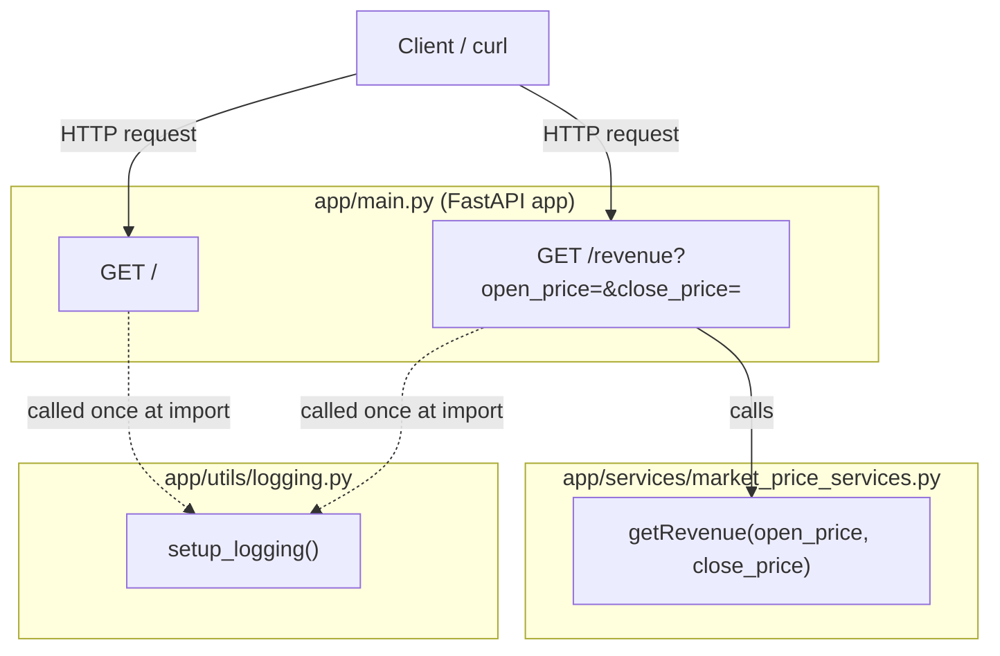
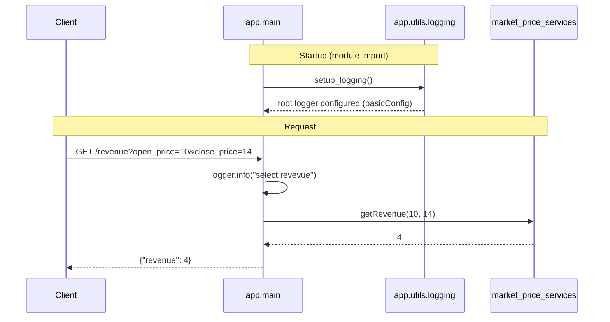

# trade-backend-py Architecture

```mermaid
flowchart TD
    Client[Client / curl]

    subgraph Main["app/main.py (FastAPI app)"]
        Root["GET /"]
        Revenue["GET /revenue?open_price=&close_price="]
    end

    subgraph Logging["app/utils/logging.py"]
        Setup["setup_logging()"]
    end

    subgraph Services["app/services/market_price_services.py"]
        GetRevenue["getRevenue(open_price, close_price)"]
    end

    Client -->|HTTP request| Root
    Client -->|HTTP request| Revenue
    Root -.->|called once at import| Setup
    Revenue -.->|called once at import| Setup
    Revenue -->|calls| GetRevenue
```

```mermaid
sequenceDiagram
    participant C as Client
    participant M as app.main
    participant L as app.utils.logging
    participant S as market_price_services

    Note over M,L: Startup (module import)
    M->>L: setup_logging()
    L-->>M: root logger configured (basicConfig)

    Note over C,S: Request
    C->>M: GET /revenue?open_price=10&close_price=14
    M->>M: logger.info("select revevue")
    M->>S: getRevenue(10, 14)
    S-->>M: 4
    M-->>C: {"revenue": 4}
```
